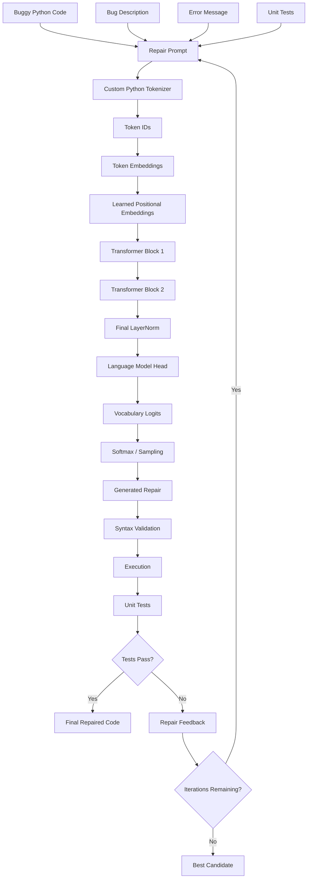
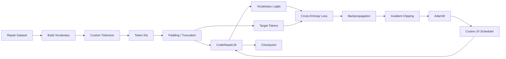
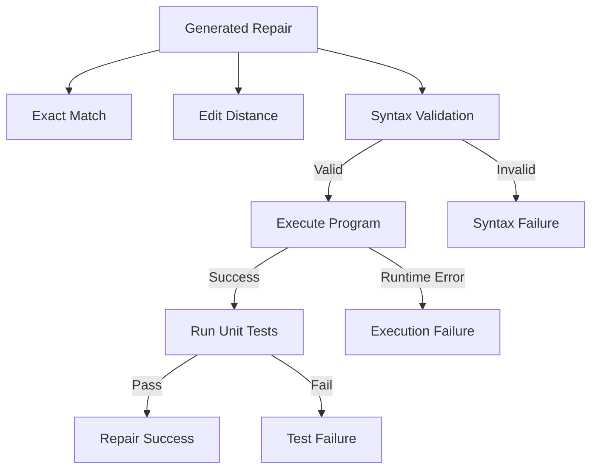
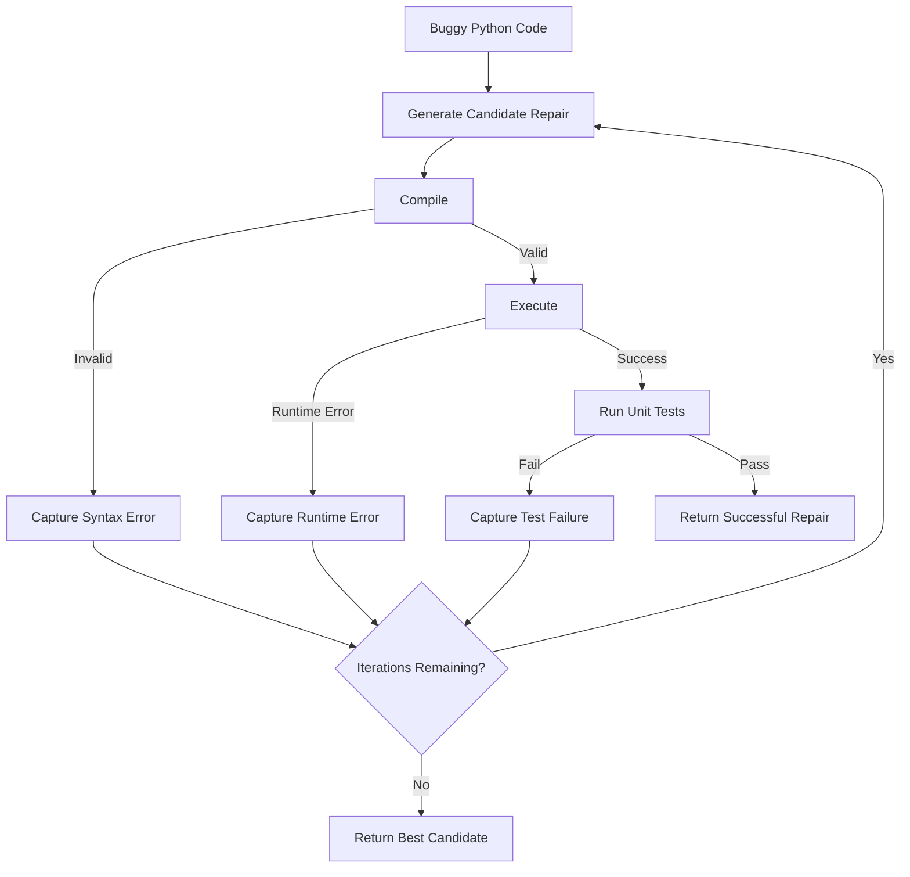

# CodeRepairLM

## A Tiny Python Code-Repair Language Model Built From Scratch

**CodeRepairLM** is a compact decoder-only Transformer language model designed to automatically repair buggy Python code.

Unlike projects that simply fine-tune an existing code LLM, CodeRepairLM implements the core language-modeling pipeline **from scratch**: a Python-aware tokenizer, causal self-attention, Transformer blocks, LayerNorm, GELU, autoregressive generation, training loop, evaluation framework, execution-based validation, and iterative repair.

The project is intentionally small enough to understand and run locally while demonstrating the complete architecture behind an autoregressive code-repair system.

---

## Project Overview

Given buggy Python code and optional debugging context:

```text
Buggy Code
+
Bug Description
+
Error Message
+
Unit Tests
        |
        v
   CodeRepairLM
        |
        v
 Generated Repair
        |
        v
 Syntax Check
        |
        v
 Execution
        |
        v
 Unit Tests
        |
        v
 Final Repair
```

The model is trained using next-token language modeling:

$$
P(x_1, x_2, \ldots, x_T)
=
\prod_{t=1}^{T} P(x_t \mid x_{<t})
$$

where $x_{<t}$ denotes all tokens preceding position $t$.
The ultimate objective is not merely to generate text that resembles the reference solution, but to generate **valid and executable Python repairs**.

---

# Key Highlights

| Area                      | Implementation                           |
| ------------------------- | ----------------------------------------- |
| Language                  | Python                                   |
| Framework                 | PyTorch                                  |
| Model                     | Decoder-only Transformer                 |
| Architecture              | GPT-style causal LM                      |
| Tokenizer                 | Custom Python-aware tokenizer            |
| Attention                 | Multi-head causal self-attention         |
| Normalization             | Custom LayerNorm                         |
| Activation                | Custom GELU                              |
| Feed Forward              | Custom implementation                    |
| Generation                | Autoregressive decoding                  |
| Objective                 | Next-token cross-entropy                 |
| Optimizer                 | AdamW                                    |
| Scheduler                 | Cosine Annealing                         |
| Evaluation                | Text + syntax + execution + tests        |
| UI                        | Streamlit                                |
| Dataset                   | Synthetic Python repair examples         |
| Execution                 | Temporary-directory subprocess execution |
| Pretrained Model          | None                                     |
| Hugging Face Transformers | Not used                                 |
| `nn.Transformer`          | Not used                                 |
| `nn.MultiheadAttention`   | Not used                                 |

---

# From-Scratch Philosophy

The project deliberately avoids high-level Transformer implementations.

The Transformer computation is explicitly implemented using tensor operations and basic neural-network primitives.

### Implemented from scratch

* Python-aware tokenization
* vocabulary construction
* causal attention
* Q/K/V projections
* attention scaling
* causal masking
* multi-head reshaping
* attention aggregation
* LayerNorm
* GELU
* feed-forward network
* residual connections
* Transformer blocks
* language-model head
* autoregressive generation
* training loop
* evaluation pipeline
* edit-distance calculation
* syntax validation
* execution-based validation
* iterative repair loop

PyTorch is used for low-level tensor computation, automatic differentiation, and standard primitives such as `Linear`, `Embedding`, and `Dropout`.

No pretrained Transformer or high-level Transformer wrapper is used.

---

# Architecture

## High-Level Architecture



---

# Transformer Data Flow

The core neural network follows:

```text
Input Token IDs
       |
       v
+-----------------------+
| Token Embedding       |
+-----------------------+
       |
       + <---- Positional Embedding
       |
       v
+-----------------------+
| Transformer Block     |
|                       |
|  LayerNorm            |
|       |               |
|       v               |
|  Causal Self-Attn     |
|       |               |
|  Residual Add         |
|       |               |
|  LayerNorm            |
|       |               |
|       v               |
|  Feed Forward         |
|       |               |
|  GELU                 |
|       |               |
|  Residual Add         |
+-----------------------+
       |
       v
   Repeat L times
       |
       v
+-----------------------+
| Final LayerNorm       |
+-----------------------+
       |
       v
+-----------------------+
| LM Head               |
+-----------------------+
       |
       v
Vocabulary Logits
       |
       v
Next Token
```

---

# Model Configuration

The default model is intentionally small.

| Hyperparameter            |            Value |
| -------------------------- | ----------------: |
| Vocabulary size           |              512 |
| Model dimension           |               64 |
| Attention heads           |                4 |
| Transformer layers        |                2 |
| Feed-forward dimension    |              128 |
| Maximum sequence length   |              128 |
| Dropout                   |              0.1 |
| Batch size                |                4 |
| Epochs                    |                5 |
| Learning rate             |           0.0005 |
| Weight decay              |             0.01 |
| Optimizer                 |            AdamW |
| Scheduler                 | Cosine Annealing |
| Maximum generation length |              128 |
| Maximum repair iterations |                3 |

The small architecture is intentional: the objective is transparency and understanding rather than maximizing parameter count.

---

# Mathematical Formulation

## 1. Token Embeddings

Let the vocabulary size be $V$ and embedding dimension be $d$.

The learned embedding matrix is:

$$
E\in\mathbb{R}^{V\times d}
$$

For token $x_t$:

$$
h_t = E[x_t]
$$

---

## 2. Positional Embeddings

Because self-attention does not inherently encode token order, learned positional embeddings are added:

$$
h_t^{(0)}
=
E[x_t]+P[t]
$$

where:

$$
P\in\mathbb{R}^{T_{\max}\times d}
$$

---

# 3. Causal Self-Attention

For hidden states $X$:

$$
Q=XW_Q
$$

$$
K=XW_K
$$

$$
V=XW_V
$$

Attention scores are calculated as:

$$
S=
\frac{QK^T}{\sqrt{d_h}}
$$

where $d_h$ is the dimensionality of one attention head.

A causal mask prevents access to future tokens:

$$
M_{ij}
=
\begin{cases}
0,&j\leq i\\
-\infty,&j>i
\end{cases}
$$

The attention matrix becomes:

$$
A=
\operatorname{softmax}
\left(
\frac{QK^T}{\sqrt{d_h}}+M
\right)
$$

The attention output is:

$$
Z=AV
$$

---

# 4. Multi-Head Attention

For $H$ attention heads:

$$
\operatorname{head}_i
=
\operatorname{Attention}(Q_i,K_i,V_i)
$$

The outputs are concatenated:

$$
Z=
\operatorname{Concat}
(
\operatorname{head}_1,
\ldots,
\operatorname{head}_H
)
$$

and projected:

$$
\operatorname{MHA}(X)=ZW_O
$$

The implementation explicitly performs the head splitting, attention calculation, causal masking, concatenation, and output projection.

---

# 5. Layer Normalization

For hidden vector $x$:

$$
\mu=
\frac{1}{d}
\sum_{i=1}^{d}x_i
$$

$$
\sigma^2=
\frac{1}{d}
\sum_{i=1}^{d}(x_i-\mu)^2
$$

Normalize:

$$
\hat{x}
=
\frac{x-\mu}
{\sqrt{\sigma^2+\epsilon}}
$$

Apply learned parameters:

$$
y=\gamma\hat{x}+\beta
$$

The repository contains a custom `LayerNorm` implementation.

---

# 6. GELU

The feed-forward network uses GELU:

$$
\operatorname{GELU}(x)
=
\frac{1}{2}x
\left[
1+
\tanh
\left(
\sqrt{\frac{2}{\pi}}
(x+0.044715x^3)
\right)
\right]
$$

This activation is implemented directly rather than relying on a Transformer wrapper.

---

# 7. Feed-Forward Network

Each Transformer block contains a position-wise feed-forward network:

$$
\operatorname{FFN}(x)
=
W_2
\operatorname{GELU}
(W_1x+b_1)
+b_2
$$

Architecture:

```text
Hidden Dimension
      |
      v
Linear(d_model -> ff_dim)
      |
      v
    GELU
      |
      v
Linear(ff_dim -> d_model)
      |
      v
Output
```

---

# 8. Residual Connections

The project uses a pre-LayerNorm Transformer formulation.

Attention:

$$
X'
=
X+
\operatorname{MHA}
(\operatorname{LN}(X))
$$

Feed-forward:

$$
Y
=
X'
+
\operatorname{FFN}
(\operatorname{LN}(X'))
$$

Therefore one Transformer block can be summarized as:

$$
X
\rightarrow
LN
\rightarrow
MHA
\rightarrow
Add
\rightarrow
LN
\rightarrow
FFN
\rightarrow
Add
$$

---

# 9. Language Model Head

After the final Transformer block:

$$
H_L=
\operatorname{LN}(H)
$$

The hidden representation is projected to vocabulary space:

$$
Z=
H_LW_{LM}+b_{LM}
$$

where:

$$
Z\in\mathbb{R}^{T\times V}
$$

The next-token probability distribution is:

$$
P(x_{t+1}\mid x_{\leq t})
=
\operatorname{softmax}(z_t)
$$

---

# 10. Autoregressive Generation

The model generates one token at a time.

Given:

$$
x_1,\ldots,x_t
$$

the next-token distribution is:

$$
p_{t+1}
=
\operatorname{softmax}
\left(
\frac{z_t}{\tau}
\right)
$$

where $\tau$ is the temperature.

Then:

$$
x_{t+1}\sim p_{t+1}
$$

The generated token is appended to the context and generation continues until `<EOS>` or the maximum generation length.

---

# Tokenization

CodeRepairLM contains a custom Python-aware tokenizer.

The tokenizer builds:

$$
\text{token}\leftrightarrow\text{ID}
$$

mappings and handles Python syntax elements including:

* keywords
* identifiers
* literals
* operators
* punctuation
* brackets
* strings
* comments
* newlines
* indentation-related tokens

Example:

```python
def add(a, b):
    return a + b
```

is represented as a sequence of Python-aware tokens rather than characters.

### Special Tokens

| Token    | Purpose                |
| -------- | ----------------------- |
| `<PAD>`  | Sequence padding       |
| `<UNK>`  | Unknown token          |
| `<BOS>`  | Beginning of sequence  |
| `<EOS>`  | End of sequence        |
| `<MASK>` | Reserved special token |

Implementation:

```text
code_repair_lm/tokenizer.py
```

---

# Repair Prompt

Training examples combine debugging information into a structured sequence:

```text
BUG:
<buggy Python code>

DESC:
<description>

ERR:
<error message>

TESTS:
<unit tests>

FIX:
<corrected Python code>
```

The model therefore learns:

$$
P(\text{Fixed Code}\mid
\text{Buggy Code},
\text{Description},
\text{Error},
\text{Tests})
$$

This formulation allows the model to use both source-code context and debugging feedback.

---

# Training Objective

CodeRepairLM is trained using autoregressive next-token prediction.

For target sequence:

$$
x_1,x_2,\ldots,x_T
$$

the objective is:

$$
\mathcal{L}
=
-\frac{1}{T}
\sum_{t=1}^{T}
\log
P(x_t\mid x_{<t})
$$

This is standard causal language-model cross-entropy.

Padding tokens are excluded from the loss.

---

# Cross-Entropy

For target token $y$ and predicted probability $p_y$:

$$
\mathcal{L}_{CE}
=
-\log p_y
$$

For the complete sequence:

$$
\mathcal{L}_{CE}
=
-\frac{1}{T}
\sum_{t=1}^{T}
\log
P(y_t\mid y_{<t})
$$

The model minimizes this loss through backpropagation.

---

# Optimization

The project uses AdamW.

First moment:

$$
m_t=
\beta_1m_{t-1}
+
(1-\beta_1)g_t
$$

Second moment:

$$
v_t=
\beta_2v_{t-1}
+
(1-\beta_2)g_t^2
$$

Bias correction:

$$
\hat{m}_t=
\frac{m_t}{1-\beta_1^t}
$$

$$
\hat{v}_t=
\frac{v_t}{1-\beta_2^t}
$$

Parameter update:

$$
\theta_{t+1}
=
\theta_t
-
\eta
\frac{\hat{m}_t}
{\sqrt{\hat{v}_t}+\epsilon}
-
\eta\lambda\theta_t
$$

where:

* $\eta$ is the learning rate
* $\lambda$ is weight decay

---

# Cosine Learning-Rate Schedule

The learning rate follows cosine annealing:

$$
\eta_t
=
\eta_{\min}
+
\frac{1}{2}
(\eta_{\max}-\eta_{\min})
\left[
1+
\cos
\left(
\frac{\pi t}{T}
\right)
\right]
$$

This gradually decreases the learning rate throughout training.

---

# Gradient Clipping

The training loop monitors gradient magnitude:

$$
\|g\|_2
=
\sqrt{
\sum_i g_i^2
}
$$

Gradients are clipped using:

$$
g
\leftarrow
g
\cdot
\min
\left(
1,
\frac{\tau}
{\|g\|_2}
\right)
$$

with a maximum gradient norm of $1.0$.

This prevents unusually large gradients from destabilizing optimization.

---

# Dataset

The current implementation uses a small synthetic Python code-repair dataset.

Each repair example contains:

```text
buggy_code
bug_description
error_message
unit_tests
fixed_code
```

The dataset contains structured examples covering scenarios such as:

* variable-name errors
* logical errors
* edge cases
* input validation
* recursive functions
* list-processing bugs
* common Python implementation mistakes

The dataset is intentionally small because this repository is primarily a **from-scratch architecture and research prototype**.

The data interface is modular and can be replaced with a larger real-world repair corpus.

---

# Training Pipeline



---

# Evaluation Pipeline

Code generation is evaluated at multiple levels.



This layered evaluation is important because textual similarity alone does not establish that a program has actually been repaired.

---

# Evaluation Metrics

## Validation Loss

$$
L_{val}
=
-\frac{1}{N}
\sum_{i=1}^{N}
\log
P(y_i\mid x_i)
$$

Lower is better.

---

## Perplexity

$$
PPL=e^{L_{val}}
$$

Lower perplexity indicates better next-token modeling of the validation corpus.

---

## Token Accuracy

$$
\text{Token Accuracy}
=
\frac{
\text{Number of Matching Tokens}
}{
\text{Number of Compared Tokens}
}
$$

This measures token-level generation accuracy.

---

## Exact Match

$$
EM
=
\frac{1}{N}
\sum_{i=1}^{N}
\mathbf{1}
[\hat{y}_i=y_i]
$$

The generated repair must exactly match the reference solution.

---

## Edit Distance

The implementation calculates Levenshtein distance.

$$
D(i,j)
=
\min
\begin{cases}
D(i-1,j)+1\\
D(i,j-1)+1\\
D(i-1,j-1)+[x_i\neq y_j]
\end{cases}
$$

Lower is better.

---

## Syntax Validity

Generated Python is checked using Python's compiler:

```python
compile(code, "<repair>", "exec")
```

The metric is:

$$
\text{Syntax Validity}
=
\frac{
\text{Syntactically Valid Repairs}
}{
N
}
$$

---

## Executable-Code Rate

$$
\text{Executable Rate}
=
\frac{
\text{Repairs Executing Successfully}
}{
N
}
$$

This captures runtime correctness beyond syntax.

---

## Unit-Test Pass Rate

$$
\text{Test Pass Rate}
=
\frac{
\text{Repairs Passing Tests}
}{
N
}
$$

This is particularly important for program-repair systems because functional correctness matters more than textual similarity.

---

## Repair Success Rate

$$
\text{Repair Success Rate}
=
\frac{
\text{Successful Repairs}
}{
N
}
$$

The current implementation uses the repository's repair-success evaluation criteria.

---

# Experimental Results

The latest successful training run produced the following measured results:

| Metric               |   Result |
| --------------------- | -------: |
| Training Loss        |   6.2248 |
| Validation Loss      |   6.1315 |
| Perplexity           | 460.1169 |
| Token Accuracy       |    2.04% |
| Exact Match Accuracy |    0.00% |
| Mean Edit Distance   |    375.0 |
| Syntax Validity Rate |    0.00% |
| Executable-Code Rate |    0.00% |
| Unit-Test Pass Rate  |    0.00% |
| Repair Success Rate  |    0.00% |

### Training Progress

| Epoch | Training Loss | Validation Loss | Perplexity |
| ----: | -------------: | ----------------: | ---------: |
|     1 |        6.3800 |          6.2155 |   500.4449 |
|     2 |        6.3316 |          6.1775 |   481.8091 |
|     3 |        6.2841 |          6.1501 |   468.7534 |
|     4 |        6.2420 |          6.1355 |   461.9841 |
|     5 |        6.2248 |          6.1315 |   460.1169 |

The validation loss decreased consistently during training:

$$
6.2155
\rightarrow
6.1775
\rightarrow
6.1501
\rightarrow
6.1355
\rightarrow
6.1315
$$

and validation perplexity decreased from:

$$
500.44
\rightarrow
460.12
$$

This indicates that the model is learning the token distribution of the training domain.

However, the generation-based repair metrics remain poor.

That is expected for the current tiny synthetic dataset and small model.

---

# An Important Experimental Observation

The experiment demonstrates that:

$$
\boxed{
\text{Better Language Modeling}
\not\Rightarrow
\text{Successful Program Repair}
}
$$

A model can reduce cross-entropy and perplexity while still generating:

* syntactically invalid code
* incomplete repairs
* incorrect identifiers
* incorrect control flow
* code that executes but fails tests

Therefore, a practical code-repair model must be evaluated at multiple levels:

```text
Token Prediction
       |
       v
Text Similarity
       |
       v
Syntax Validity
       |
       v
Runtime Execution
       |
       v
Unit Tests
       |
       v
Functional Correctness
```

This is one of the key motivations for including execution-based evaluation in CodeRepairLM.

---

# Iterative Repair System

The repository also contains an iterative repair loop.



Each iteration can use the observed failure information to construct the next repair attempt.

The system tracks:

* candidate repair
* compilation result
* execution result
* stdout
* stderr
* exception information
* test result
* iteration number
* final pass/fail status

Implementation:

```text
code_repair_lm/sandbox.py
```

---

# Streamlit Interface

The project includes an interactive Streamlit application.

The interface accepts:

| Input           | Description                             |
| ---------------- | ----------------------------------------- |
| Buggy Code      | Python code containing the defect       |
| Bug Description | Optional natural-language explanation   |
| Error Message   | Optional traceback/compiler information |
| Unit Tests      | Optional validation tests               |

The UI displays:

* generated repair
* code diff
* repair iterations
* execution results
* test results
* final validation status

Run:

```bash
streamlit run app.py
```

---

# Repository Structure

```text
CodeRepairLM/
│
├── app.py
├── train.py
├── evaluate.py
├── requirements.txt
├── pyproject.toml
│
├── configs/
│   └── default.json
│
├── code_repair_lm/
│   ├── __init__.py
│   ├── config.py
│   ├── data.py
│   ├── evaluation.py
│   ├── model.py
│   ├── sandbox.py
│   ├── streamlit_app.py
│   ├── tokenizer.py
│   └── training.py
│
├── tests/
│   └── test_core.py
│
├── checkpoints/
│
├── artifacts/
│   ├── final_metrics.json
│   └── evaluation_metrics.json
│
└── README.md
```

---

# Module Breakdown

## `model.py`

Core Transformer implementation.

```text
GELU
LayerNorm
CausalSelfAttention
FeedForward
TransformerBlock
CodeRepairLM
Autoregressive Generation
```

---

## `tokenizer.py`

Custom Python-aware tokenizer.

```text
Vocabulary Construction
Tokenization
Encoding
Decoding
Special Tokens
Token <-> ID Mapping
```

---

## `data.py`

Dataset representation.

```text
RepairExample
Synthetic Repair Corpus
Bug Metadata
Repair Context
```

---

## `training.py`

Training infrastructure.

```text
Seed Initialization
Batching
Loss Calculation
Backpropagation
Gradient Clipping
AdamW
Cosine Scheduler
Validation
Checkpointing
```

---

## `evaluation.py`

Evaluation framework.

```text
Validation Loss
Perplexity
Token Accuracy
Exact Match
Edit Distance
Syntax Validation
Executable-Code Rate
Unit-Test Pass Rate
Repair Success
```

---

## `sandbox.py`

Execution and iterative repair.

```text
Temporary Runtime
Python Compilation
Subprocess Execution
Unit-Test Execution
Output Capture
Exception Capture
Repair Iteration
Candidate Tracking
```

---

## `streamlit_app.py`

Interactive code-repair interface.

---

# Why Decoder-Only?

CodeRepairLM treats repair as a conditional generation problem:

$$
P(
\text{Fixed Code}
\mid
\text{Buggy Code},
\text{Description},
\text{Error},
\text{Tests}
)
$$

A decoder-only architecture naturally supports this formulation.

### Decoder-only

```text
Context + Previous Tokens
            |
            v
      Causal Transformer
            |
            v
       Next Token
```

Advantages:

* simple architecture
* naturally autoregressive
* directly supports code generation
* one Transformer stack
* straightforward training objective
* easy to implement from scratch

### Encoder-only

An encoder-only model is better suited to:

* classification
* representation learning
* bug detection
* embedding generation

It does not naturally generate an arbitrary repaired program.

### Encoder-decoder

An encoder-decoder architecture would explicitly separate:

```text
Buggy Code + Context
        |
        v
     Encoder
        |
        v
   Representation
        |
   Cross Attention
        |
        v
     Decoder
        |
        v
    Fixed Code
```

This is also a valid design for code repair, but it introduces an additional Transformer stack and cross-attention mechanism.

For this project, decoder-only provides a compact architecture while still demonstrating the fundamental mechanics of an autoregressive language model.

---

# Why Python-Only?

Python was selected deliberately because it provides a practical environment for:

* rapid model experimentation
* code parsing
* syntax validation
* subprocess execution
* unit-test execution
* Streamlit deployment
* ML experimentation with PyTorch

It also allows the generated output to be validated directly using Python's own compiler and testing infrastructure.

---

# Execution and Safety

The prototype uses temporary directories and subprocess execution to evaluate generated Python programs.

The execution flow is:

```text
Generated Code
      |
      v
Temporary Directory
      |
      v
Compilation
      |
      v
Subprocess Execution
      |
      v
Capture stdout/stderr
      |
      v
Unit Tests
```

The current implementation is suitable for controlled experimentation.

It should **not** be considered a hardened security sandbox for arbitrary hostile code. A production deployment would require stronger isolation such as:

* containers or microVMs
* CPU limits
* memory limits
* execution timeouts
* filesystem restrictions
* network isolation
* process restrictions
* resource quotas

---

# Installation

Clone the repository:

```bash
git clone https://github.com/Arjun-08/CodeRepairLM_tiny-LLM.git
cd CodeRepairLM_tiny-LLM
```

Install dependencies:

```bash
pip install -r requirements.txt
```

---

# Training

Run:

```bash
python train.py
```

The training process reports:

```text
Epoch
Batch
Training Loss
Gradient Norm
Learning Rate
Validation Loss
Perplexity
Checkpoint Events
Runtime
```

Training artifacts are stored under:

```text
checkpoints/
artifacts/
```

---

# Evaluation

Run:

```bash
python evaluate.py
```

Evaluation results are written to:

```text
artifacts/evaluation_metrics.json
```

---

# Streamlit Application

Start the UI:

```bash
streamlit run app.py
```

The browser interface allows you to submit buggy Python code and inspect the model's generated repair and validation results.

---

# Unit Tests

Run the project tests:

```bash
python -m pytest -q
```

The test suite covers the core project functionality.

---

# Reproducibility

The training pipeline supports deterministic experiment setup through a fixed seed.

Default:

```json
{
  "seed": 1337
}
```

Model and training configuration are stored in:

```text
configs/default.json
```

Checkpoints and evaluation artifacts are written to dedicated directories.

---

# Current Limitations

This repository should be viewed as a **research and learning prototype**, not a production-grade code-repair model.

### Dataset

The current dataset is very small and synthetic.

### Model Capacity

The default model contains only:

$$
2\text{ Transformer layers}
$$

with:

$$
d_{model}=64
$$

Therefore its representational capacity is intentionally limited.

### Context Length

The default context window is only:

$$
128\text{ tokens}
$$

which limits the size of programs and debugging context that can be processed.

### Tokenizer

The custom tokenizer is Python-aware but does not provide the compression and vocabulary efficiency of modern BPE or SentencePiece tokenizers.

### Repair Quality

The current generation metrics are weak because the model is trained on a tiny corpus.

### Sandbox

The execution environment is designed for experimentation rather than security-critical arbitrary-code execution.

---

# Future Work

## Dataset Expansion

* larger synthetic repair corpus
* GitHub bug-fix commits
* real Python repair datasets
* repository-level repair examples
* bug-type stratification
* repository-level train/test separation

## Model Improvements

* larger Transformer
* longer context
* improved tokenizer
* more layers
* more attention heads
* embedding weight tying
* learning-rate warmup
* label smoothing
* beam search
* top-k sampling
* top-p sampling

## Repair Improvements

* compiler-feedback conditioning
* test-feedback conditioning
* execution-guided decoding
* multi-candidate generation
* candidate ranking
* best-of-$k$ repair
* confidence estimation
* repair-by-iteration analysis

## Evaluation Improvements

* pass@k
* functional correctness
* repair success by bug type
* repair success by iteration
* inference latency
* parameter count
* memory footprint
* ablation studies

---

# What This Project Demonstrates

CodeRepairLM demonstrates the complete lifecycle of a small language model:

```text
                    DATA
                     |
                     v
              Custom Tokenizer
                     |
                     v
              Token Embeddings
                     |
                     v
           Causal Self-Attention
                     |
                     v
             Transformer Blocks
                     |
                     v
              Language Model
                     |
                     v
            Next-Token Training
                     |
                     v
              Autoregressive
                Generation
                     |
                     v
              Generated Repair
                     |
          +----------+----------+
          |          |          |
          v          v          v
       Syntax    Execution   Unit Tests
       Check      Check        Check
          |          |          |
          +----------+----------+
                     |
                     v
              Repair Decision
```

The project therefore covers both **language-model fundamentals** and **software-engineering-oriented evaluation**.

---

# Core Takeaway

The central design principle of CodeRepairLM is:

$$
\boxed{
\text{Generate}
\rightarrow
\text{Validate}
\rightarrow
\text{Execute}
\rightarrow
\text{Test}
\rightarrow
\text{Repair Again}
}
$$

A code-repair model should not be judged only by whether its output resembles a reference solution.

The more meaningful hierarchy is:

$$
\boxed{
\text{Token Accuracy}
<
\text{Text Similarity}
<
\text{Syntax Validity}
<
\text{Execution}
<
\text{Functional Correctness}
}
$$

This project is an intentionally transparent implementation of that idea.

---

# Project Status

**Working research prototype**

The complete end-to-end pipeline is implemented:

$$
\text{Dataset}
\rightarrow
\text{Tokenizer}
\rightarrow
\text{Transformer}
\rightarrow
\text{Training}
\rightarrow
\text{Checkpoint}
\rightarrow
\text{Generation}
\rightarrow
\text{Evaluation}
\rightarrow
\text{Execution}
\rightarrow
\text{Iterative Repair}
\rightarrow
\text{Streamlit UI}
$$

The current experimental results establish a baseline for the architecture. The next major improvement is expanding the repair corpus and increasing model capacity so that improvements in language modeling translate into measurable functional repair performance.

---

# Author

**Arjun Sagar N V**

M.Tech, Signal Processing
Indian Institute of Science (IISc), Bengaluru

GitHub: [Arjun-08](https://github.com/Arjun-08)

---

## Repository

[CodeRepairLM — Tiny LLM](https://github.com/Arjun-08/CodeRepairLM_tiny-LLM)
